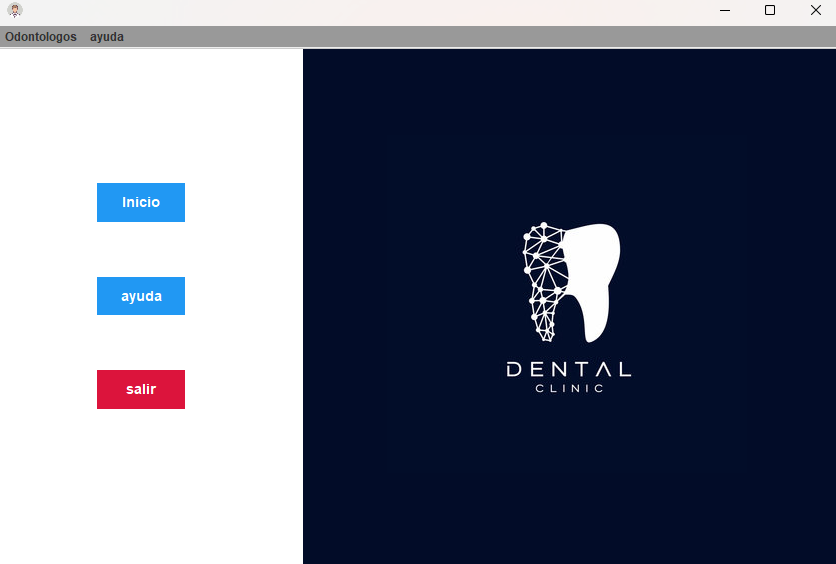

# LAB v1.0.0

## 📌 Descripción
**LAB** es una aplicación diseñada para la gestión de un laboratorio odontológico. Permite administrar odontólogos, pacientes y sus tratamientos, así como controlar los ingresos y gastos del laboratorio. La aplicación ofrece herramientas para el seguimiento de deudas, facturación mensual y generación de reportes en Excel o impresos.

## 🛠️ Funcionalidades principales
- **Gestión de odontólogos y pacientes**: Registro de odontólogos y asignación de pacientes.
- **Control de tratamientos**: Carga de trabajos especiales con sus costos.
- **Cálculo de facturación mensual**:
  - Total facturado por paciente y odontólogo.
  - Deuda pendiente de cada paciente y odontólogo.
- **Gestión de gastos**: Registro de costos del laboratorio, incluyendo proveedores y materiales.
- **Reporte financiero mensual**:
  - Facturación total del laboratorio.
  - Gastos totales.
  - Balance final (diferencia entre ingresos y egresos).
- **Generación de reportes**:
  - Impresión de tickets de comprobante.
  - Exportación de tablas a Excel:
    - Pacientes de un odontólogo.
    - Facturación mensual.
    - Gastos del laboratorio.

## 🚀 Instalación y ejecución
### Requisitos previos
- Windows 10 o superior.
- Java Runtime Environment (JRE) si la aplicación lo requiere.

### Pasos para ejecutar la aplicación
1. **Descargar el archivo `.zip`** desde la sección de [Releases](https://github.com/martinlopez05/proyecto-LABv1.0.0/releases).
2. **Extraer el `.zip`** en una carpeta de tu escritorio.
3. **Abrir la carpeta** donde se extrajo la aplicación.
4. **Ejecutar el archivo** `Lab v1.0.0.exe`.
5. ¡Listo! 🎉 La aplicación estará en funcionamiento.
6. NO BORRAR LA CARPETA DATA ❌, ya que allí se encontrará la base de datos.

## 📊 Exportación de datos
Para facilitar la gestión y análisis de la información, la aplicación permite exportar las tablas principales a archivos Excel (`.xlsx`).

## 🛠️ Tecnologías utilizadas
- **Java** (para la lógica de la aplicación).
- **JPA (Java Persistence API)** para la gestión de la base de datos.
- **Controllers y Unit Persistence** para la estructura del proyecto.
- **Swing** para la interfaz gráfica.
- **Base de datos embebida H2**, que permite crear la base de datos dentro de la carpeta del proyecto.
- **Maven** para la gestión de dependencias y compilación del proyecto.
- **Javadocs** para documentación del código.

  ## 📸 Capturas de Pantalla

### 🔹 Pantalla principal

### 🔹 Registro de pacientes

## 📝 Contacto y soporte
Si tienes dudas o sugerencias, puedes contactarme a través de mi GitHub: [martinlopez05](https://github.com/martinlopez05).

---
¡Gracias por usar **LAB**! 🦷💻

